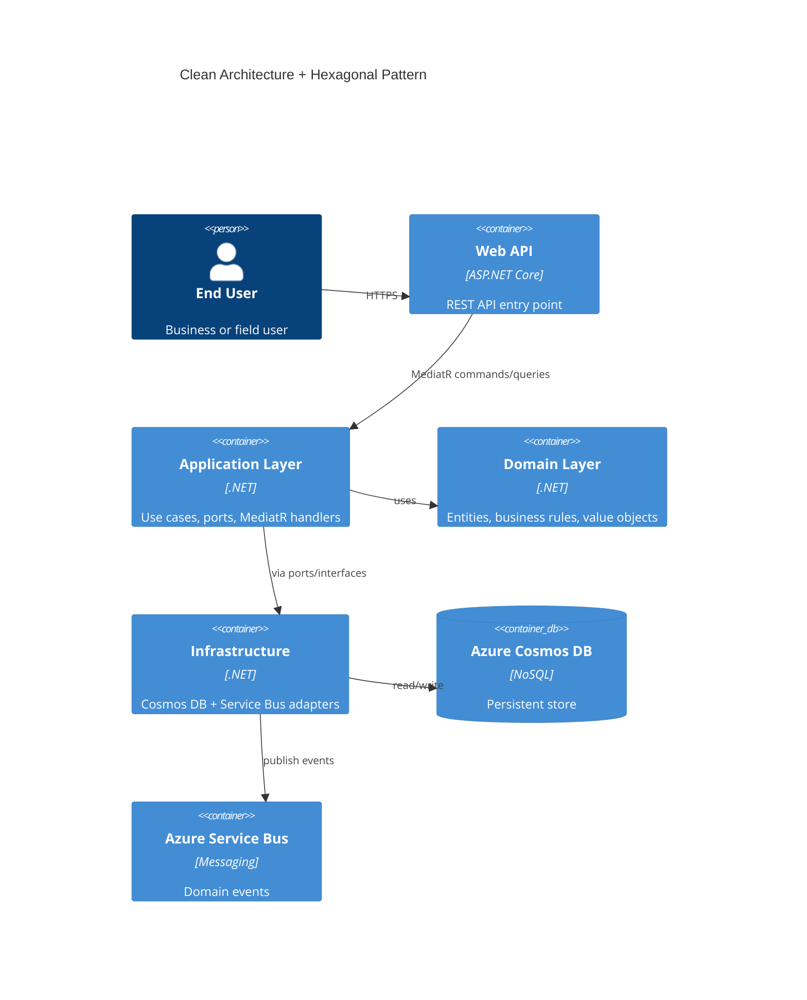

# Reference architecture diagram

```mermaid
C4Container
    title Clean Architecture + Hexagonal Pattern

    Person(user, "End User", "Business or field user")

    Container(WebAPI, "Web API", "ASP.NET Core", "REST API entry point")
    Container(Application, "Application Layer", ".NET", "Use cases, ports, MediatR handlers")
    Container(Domain, "Domain Layer", ".NET", "Entities, business rules, value objects")
    Container(Infrastructure, "Infrastructure", ".NET", "Cosmos DB + Service Bus adapters")
    ContainerDb(CosmosDB, "Azure Cosmos DB", "NoSQL", "Persistent store")
    Container(ServiceBus, "Azure Service Bus", "Messaging", "Domain events")

    Rel(user, WebAPI, "HTTPS")
    Rel(WebAPI, Application, "MediatR commands/queries")
    Rel(Application, Domain, "uses")
    Rel(Application, Infrastructure, "via ports/interfaces")
    Rel(Infrastructure, CosmosDB, "read/write")
    Rel(Infrastructure, ServiceBus, "publish events")
```
