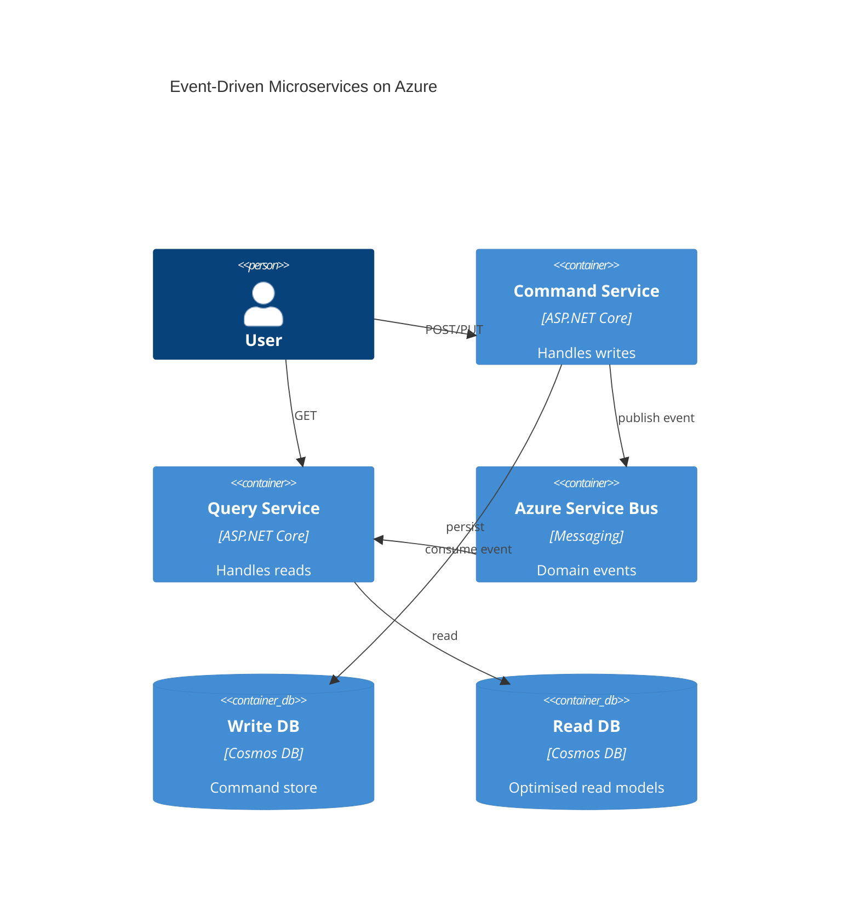

# C4 Diagram: Event-driven Microservices

```mermaid
C4Container
    title Event-Driven Microservices on Azure

    Person(user, "User")
    Container(CommandAPI, "Command Service", "ASP.NET Core", "Handles writes")
    Container(QueryAPI, "Query Service", "ASP.NET Core", "Handles reads")
    Container(ServiceBus, "Azure Service Bus", "Messaging", "Domain events")
    ContainerDb(WriteDB, "Write DB", "Cosmos DB", "Command store")
    ContainerDb(ReadDB, "Read DB", "Cosmos DB", "Optimised read models")

    Rel(user, CommandAPI, "POST/PUT")
    Rel(user, QueryAPI, "GET")
    Rel(CommandAPI, WriteDB, "persist")
    Rel(CommandAPI, ServiceBus, "publish event")
    Rel(ServiceBus, QueryAPI, "consume event")
    Rel(QueryAPI, ReadDB, "read")
```
